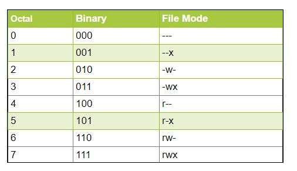

# Understanding Permissions

Unix-like operating systems allow multiple users to work on the same server simultaneously without disrupting each other.

Individuals sharing access to files risk exposing classified information or even data loss if other users access their files or directories. To address this, Unix added the file permission feature to specify how much power each user has over a given file or directory.

You may recall from previous sections the `ls -la` command, which gives the following output:
~~~
total 36
drwxr-xr-x 1 nelle nelle   188 Nov  3 08:40 .
drwxr-xr-x 1 nelle nelle    34 Nov  3 08:40 ..
-rw-r--r-- 1 nelle nelle   199 Nov  3 08:40 .bash_profile
drwxr-xr-x 1 nelle nelle    46 Nov  3 08:40 creatures
drwxr-xr-x 1 nelle nelle   156 Nov  3 08:40 data
drwxr-xr-x 1 nelle nelle    16 Nov  3 08:40 Desktop
drwxr-xr-x 1 nelle nelle   126 Nov  3 08:40 molecules
drwxr-xr-x 1 nelle nelle    20 Nov  3 08:40 north-pacific-gyre
-rw-r--r-- 1 nelle nelle    86 Nov  3 08:40 notes.txt
-rw-r--r-- 1 nelle nelle    32 Nov  3 08:40 pizza.cfg
-rw-r--r-- 1 nelle nelle 21583 Nov  3 08:40 solar.pdf
drwxr-xr-x 1 nelle nelle    54 Nov  3 08:40 writing
~~~
{: .output}

There is a lot of information in these lines, but lets focus on the first column:

- **d**	The file is a directory.
- **r**	Permission to "read" a file (e.g. open a file in a text editor or copy a file).
- **w**	Permission to "write" to (modify) a file (e.g. save changes to a file in a text editor, or delete a file).
- **x**	Permission to "execute" a file (e.g. run a BASH script using`./file.sh` command instead of `bash file.sh`).
- **-**	If any character in `rwx` is replaced by `-`, that permission has been revoked.

# Who do these Permissions Apply To?

The third column of `ls -a' lists the **user** and **group** owners for each file. Groups are used to manage permissions over collections users. For example, users with admin privileges are members of the `sudo` (super-user) group. 

The first set of `rwx` refers to the user, the second to the group and the last to all users that are not the owning user or a member of the owning group. 
 
On a Pawsey file system, you may see something like:
~~~
$ -rwxr-xr--  1 username interns0001 282 Jan  6  2022 code_for_project.py
~~~
From above, we see that `username` can read, write (modify) and execute `code_for_project.py` and that users in `interns0001` can read and execute `code_for_project.py`. Users who are not `username` or not in the `interns0001` group can only read  `code_for_project.py`. 

On Pawsey systems, you will be a member of a `group` that contains yourself, your supervisor(s) and any other collaborators. For `username` in the above example, this group is `interns0001`.

# Changing Permissions

To collaborate with other users, you may need to change the permissions of a file. The'chmod' command (short for change mode) is the main method of doing this. It has the syntax:

	chmod [references][operator][modes] filename
	
**Note:** There are no spaces between `[references][operator][modes]`.

The `[references]` value specifies which of the three groups you want to modify:
  - **u** for user
  - **g** for group
  - **o** for others
  - any combination of `u`, `g` and `o'.

The `[operator]` value specifies whether you are adding, removing or assigning a permission:
- **‘+’** for adding
- **‘-‘** for removing
- **“=”** for assigning a permission.

Finally, the `[modes]` value specifies the permission (or permissions) to modify:
- **‘r’** read
- **w** write
- **x** execute
- any combination of `r`, `w` and `x`

For example, if `username` would like help debugging `code_for_project.py` from another member of their research group, they may want to add write permissions for users in the `interns0001` group:

~~~
$ chmod g+w code_for_project.py
~~~
{: .language-bash}

> ## Octal permissions
>
> 
> Given that permissions need to be stored for every single file and directory, the storage
> costs of this information would quickly grow if not represented efficiently.
> Internally file permissions are represented as a bit mask where different permissions correspond to
> different set bits. As such a group of three permissions `rwx` can be represented as a decimal number `7`.
> As such you may see chmod command that look like:
> ~~~
> $ chmod 777
> ~~~
> {: .language-bash}
> which is equivalent to
> ~~~
> $ chmod ugo+rwx
> ~~~
> {: .language-bash}
> You don't need to worry about these at all as the letter permissions are used more often, but it is good to be aware of the history.
{: .callout}

> ## Checking Permissions
>
> I am logged in as `nelle` and this is my output of `ls -la` command
> ~~~
> -rw-r--r-- 1 nelle nelle    34 Nov  3 08:40 .profile
> ~~~
> {: .language-bash}
> > ## Solution
> Will I be able to write into this file:
> > Yes, the user has the read and write permissions so can modify the file
> {: .solution}
>
> I am logged in as `adam` and this is my output of `ls -la` command
> ~~~
> drwxr-xr-x 1 nelle nelle    4096 Oct  3 09:41 Documents
> ~~~
> {: .language-bash}
> Will adam be able to move a file into the documents directory?
> > ## Solution
> > No Bob belongs to the “others” category, which doesn’t have the write permission on the folder
> {: .solution}
{: .challenge}

> ## Changing Permissions
>
> What Permissions will the following command give?
> ~~~
> chmod ugo=rwx
> ~~~
> {: .language-bash}
> > ## Solution
> > `ugo=rwx` is equivalent to the following permissions : r w x r w x r w x so all permissions for all users.
> {: .solution}
>
> What is the command for setting the permissions to r w – r – – – – x
> Will adam be able to move a file into the documents directory?
> > ## Solution
> > ~~~
> > chmod u+rw,g=r,o=x
> > ~~~
> > {: .language-bash}
> > We set the user permissions to read (r) write (w), the group permissions to read and other permissions to execute
> {: .solution}
{: .challenge}

> ## Tricky Questions
>
> if a directory with ” r w x r w x r w x” permissions is copied using the cp command, will the permissions be the same on the new directory ?
> > ## Solution
> > No. In order for the permissions to be preserved, you have to run cp with the -p option.
> {: .solution}
>
> what is the difference between a lowercase “t” and an uppercase “T” for the sticky bit? (you may have to google this)
> > ## Solution
> > A lowercase t means that the sticky bit is set whereas an uppercase T means that the sticky bit is set but the execute permission is not set.
> {: .solution}
{: .challenge}
